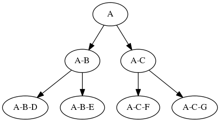

# Eionet site directory
The Eionet Site directory is a service to manage authentication, authorisation, user information and mailing lists.

## Eionet Users
The users are kept in LDAP at the branch ou=Users,o=EIONET,l=Europe.

The account smith will have this DN: uid=smith,ou=Users,o=EIONET,l=Europe

Role object classes and attributes The object class are inetOrgPerson and organizationalPerson
* cn: contains the full name of the person
* mail: contains the email address
* sn, givenName, telephoneNumber
* uid: user id

## Eionet organisations

Organisations are groups in the LDAP directory.

A typical organisation DN looks like this: cn=al_apo_maf,ou=Organisations,o=EIONET,l=Europe

### Business logic

The user can change the organisation in his/her own profile. The idea being that the user needs to be able to update his organisation without having to open a ticket with the helpdesk. But this it can be changed, the field can be made to appear only for managers and NFPs. At the moment being member of a certain organisation doesn't give the user any special access (unlike having the eea role).

### Role object classes and attributes

The object class is groupOfUniqueNames, labeledURIObject and organizationGroup from the Eionet schema.
* cn: contains the id of the organisation. E.g. al_apo_maf
* uniqueMember The members are in the attribute uniqueMember, and the attrribute is repeated
   with one user DN per row. If the role has no members, there will be a uniqueMember attribute with the empty string as value.
* o: Full name of the organisation
* telephoneNumber, facsimileTelephoneNumber, street, postOfficeBox, postalCode, postalAddress, st, l, description

## Eionet Roles structure

Eionet roles are groups of Eionet users and are used for both authorisation and mail lists.
A role has a mail address that is `myrole@roles.eea.eionet.europa.eu`

The roles are kept in LDAP at the branch ou=Roles,o=EIONET,l=Europe.

Roles are hierarchical, and have this structure:

The role eionet-etc-scp will have this DN: cn=eionet-etc-scp,cn=eionet-etc,cn=eionet,ou=Roles,o=EIONET,l=Europe

To find out what roles the user 'smith' is a member of you create an LDAP query filter like this:
<pre>
(uniqueMember=uid=smith,ou=users,o=eionet,l=europe)
</pre>
and do a subtree search from the base ou=Roles,o=EIONET,l=Europe

### Role object classes and attributes

The object class is groupOfUniqueNames.
* uniqueMember The members are in the attribute uniqueMember, and the attrribute is repeated
   with one DN per row. It is a LDAP class violation to not have a uniqueMember attribute. Therefore, _if the role has no members, there will be a uniqueMember attribute with the empty string as value._
   Members can be [EionetUsers users] or [EionetOrganisations organisations]. The organisations are not currently used for email nor authorisation.
* cn: contains the id of the role. E.g. eionet-etc-scp
* owner: contains the administrators of the role. These are always user DNs. Administrators are the persons who can modify the role.

## LDAP principles

 See: http://www.zytrax.com/books/ldap/ch3/
